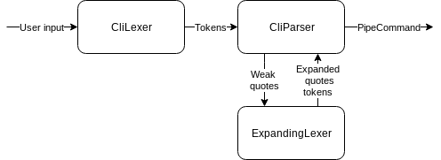
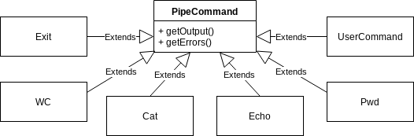

# Диаграмма потока данных

# Диаграмма наследования

Программа разделена на 3 основные компоненты: лексер пользовательского ввода, парсер и команды, в которых содержится сама логика их исполнения. Каждая команда наследуется от класса `PipeCommand`.  
Пользовательский ввод за один проход анализируется лексером, после чего результат передается парсеру. Затем по ходу работы парсера участки, на которых возможно появление подстановки переменных, дополнительно обрабатываются еще одним лексером. 
